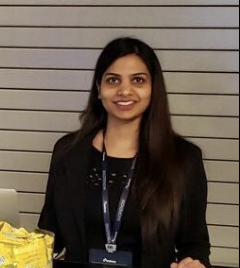

<h1 align="center">Shraddha Sharma</h1>

  📍 Houston, TX • 📞 480-643-0392 • 📧 shraddha.uconn@gmail.com  
   
  <a href="https://www.linkedin.com/in/shraddha18">LinkedIn</a> • 
  <a href="https://github.com/MeetShraddha">GitHub</a> • 
  <a href="https://scholar.google.com/citations?view_op=list_works&hl=en&user=7UGNvYgAAAAJ">Google Scholar</a>

---

## 🎓 Education

<table style="border: none; width: 100%;">
  <tr>
    <td style="vertical-align: top; border: none;">
      
<strong>University of Illinois Urbana-Champaign</strong> <em>MBA – Current Student</em>
 
      
<strong>University of Connecticut</strong> <em>MS in Business Analytics & Project Management</em>
 
      
<strong>Rajiv Gandhi Proudyogiki Vishwavidyalaya</strong> <em>BE in Information Technology</em>

    </td>
    <td style="text-align: right; border: none;">
      
    </td>
  </tr>
</table>

---

## 🗞 Publications & Presentations

- *Aligning Advanced Distribution Analytics with Regulatory Frameworks, IEEE PES, Washigton DC, USA, 2026
- *Energy-Positive Buildings in Smart Cities*, IET Smart Cities Symposium, Bahrain 2024
- *Bill Projection Using ML*, Utility Analytics Summit, San Diego, CA 2022
- *Information Extraction*, OnRamp Insurance Conference, Minneapolis, Minnesota 2019
- *Gamifying Data Capture - A Pilot Study*, WITS, Dublin, Ireland 2016
  
---

## 📚 Academic Service

- Reviewer for **2025 IEEE PES Conference**, PESGM2026
- Reviewer for **2025 IEEE International Communication Energy Conference**, Houston, Texas (Oct 12–15, 2025)
  
---

## 💼 Work Experience

### Entergy Services LLC – *Sr Staff Data Scientist, AI Department*  
*Houston, TX | Nov 2019 – Present*  
- Developed LLM-RAG chatbot evaluation models  
- Built models for meter tampering & energy theft detection, bill prediction, transformer failure prediction  
- Led ML research & improved AI platform infrastructure

### Synechron Inc. – *Sr Data Scientist, AI Lab*  
*Piscataway, NJ | Jan 2017 – Oct 2019*  
- Analyzed RAG model performance with acronym-based queries  
- Built dashboards for recall, precision, and relevancy  
- Created ML/NLP solutions including resume parser & timeseries tools  
- Developed langchain AI agents for feedback-aware bots

### Accenture Services – *Software Engineering Associate*  
*Bangalore, India | Mar 2013 – Dec 2015*  
- Developed sentiment analysis tools & optimized SQL performance  
- Integrated Hadoop with BI platforms reducing costs by 40%
  
---

## 🏅 Awards & Memberships

- **Impact Award**, Entergy (2023)  
- **Star Steller Award**, Accenture (2014)  
- Member, Utility Analytics Institute – Customer Analytics Community

---

## 📜 Certifications

- Six Sigma Black Belt, Aveta (2023)  
- Hypothesis Driven Development, UVA (2024)  
- Advanced ML on GCP, Google Cloud (2023)  
- Psychological Research Specialization, APA (2023)  
- Text Retrieval, UIUC (2018)  
- Scala Programming, EPFL (2018)
  
---
